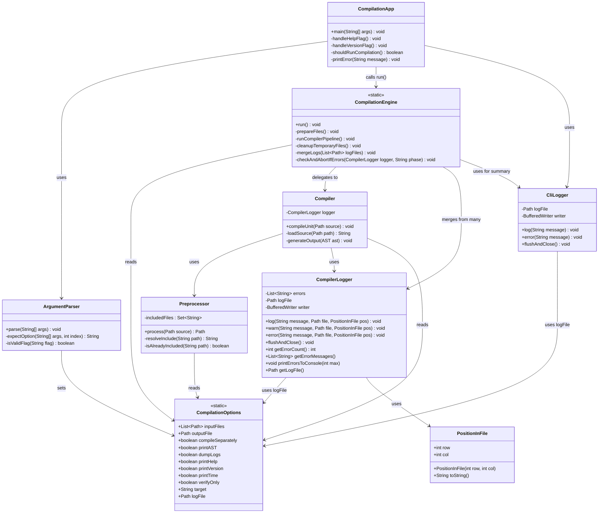

# 🔧 Java Compiler Project

A fully custom-built compiler in Java, including a lexer, parser, AST, code generator, virtual machine, and command-line interface.

## 📦 Module Structure

```text
src/
├── cli/                → Command-line interface (CLI)
│   ├── CompilationApp.java
│   ├── ArgumentParser.java
│   └── CliLogger.java
├── compiler/           → Compiler logic
│   ├── CompilationEngine.java
│   ├── CompilerLogger.java
│   ├── Lexer.java, Parser.java, ASTNode.java, ...
├── util/               → Helper functions & logging
│   └── CompilationOptions.java
```

```
java CompilationApp -help

# Compile
java CompilationApp -i src/main.sc -o out/main.pain

# Print AST
java CompilationApp -i src/main.sc -ast

# Compile with timing and logging
java CompilationApp -i src/main.sc -o out/main.pain -time -log
```
---

## 🧪 Usage

```bash
# Show help
java CompilationApp -help

# Compile a complete project
java CompilationApp -i src/main.sc -o out/main.pain

# Print AST only
java CompilationApp -i src/main.sc -ast

# Verify syntax without generating output
java CompilationApp -i src/main.sc -verify

# Compile with time measurement and logging
java CompilationApp -i src/main.sc -o out/main.pain -time -log

# Compile separately
java CompilationApp -i src/utils.sc -o out/utils.pain -c
java CompilationApp -i src/main.sc -o out/main.pain -c

# Generate x86 assembly output
java CompilationApp -i src/main.sc -o out/main.pain -target asm
```

---

## ⚙️ Options (`CompilationOptions`)

| Option      | Parameter           | Description                                                                                          |
|-------------|---------------------|------------------------------------------------------------------------------------------------------|
| `-help`     | *(none)*            | Displays this help screen                                                                            |
| `-i`        | `<source-file(s)>`  | Input source files                                                                                   |
| `-o`        | `<output-file>`     | Output file                                                                                          |
| `-c`        | *(none)*            | Compile each file separately                                                                         |
| `-version`  | *(none)*            | Shows the current version                                                                            |
| `-time`     | *(none)*            | Displays compilation time                                                                            |
| `-ast`      | *(none)*            | Writes AST to file                                                                                   |
| `-log`      | *(none)*            | Keeps the log file after compilation                                                                 |
| `-verify`   | *(none)*            | Syntax check only, no code generation                                                                |
| `-target`   | `<target-name>`     | Defines the target system to compile to (default: `sm`)<br/> use `asm` to generate assembly x86 code |

---

## 📊 Architecture – Class Diagram

<details>
<summary><strong>Show Diagram</strong></summary>



</details>

---

## 🗂 Example Output (with `-log` and `-ast`)

```text
out/
├── main.pain           ← Compiled target (.pain) file
├── main.ast.txt      ← AST dump
├── main.log.txt      ← CLI log file
```

Temporary files like `lexer.tmp`, `parser.tmp` are automatically deleted unless debugging is enabled.

---

## 🧠 Notes

- Only ASTs and related trees are kept in memory.
- Source code, tokens, logs, etc. are written to disk.
- Temporary files go to `temp/`, logs and output to `out/`.

---

## 📍 License & Contributions

> This project is a learning-oriented compiler built in Java. Feel free to fork, test, improve!