# 🔧 Java Compiler Project (Schiemens Compiler)

A fully custom-built compiler in Java, including all major phases: CLI processing, preprocessing, lexing, parsing, parse tree construction, AST generation, IR generation, custom Bytecode generation, logging and virtual machine implementation.

The name "Schiemens" is a playful nod to the worldwide known german enterprise "Siemens", but this project is not affiliated with them in any way.  
I just hate Siemens products – they are overused, overpriced and just garbage. Especially TIA-Portal (+SCL-Programming language and Compiler) and WinCC.  
The project is a learning-oriented compiler, built from scratch to understand the intricacies of compiler design and implementation.
The goal is to create a fully functional compiler that can compile and execute Schiemens code, a custom programming language designed for this project.

The Schiemens language is a high-level, statically typed language with a syntax similar to Java and C/C++. It supports object-oriented programming and imperative programming paradigms. 
The language is designed to be easy to read and write, with a focus on simplicity and clarity.
The compiler is designed to be modular and extensible, allowing for easy addition of new features and optimizations in the future.
The compiler is built using Java and follows a modular architecture, with each phase of the compilation process implemented as a separate module. 
This allows for easy testing and debugging of each phase, as well as the ability to swap out or modify individual components without affecting the entire compiler.

---

# ✅ Compiler Development Task Checklist

This file tracks progress across all phases of compiler implementation.

| Task                             | Coded | Shallow Tested | Fully Tested | Last Update | Comment                            |
|:---------------------------------|:------|:---------------|:-------------|:------------|:-----------------------------------|
| Planning                         | ✅     | *(none)*       | *(none)*     | 2025-04-12  |                                    |
| Architecture Design              | ✅     | *(none)*       | *(none)*     | 2025-04-12  | will probably change in the future |
| Command-Line Interface (CLI)     | ❌     | ❌              | ❌            | -           |                                    |
| Preprocessor                     | ❌     | ❌              | ❌            | -           |                                    |
| Lexer                            | ❌     | ❌              | ❌            | -           |                                    |
| Parser                           | ❌     | ❌              | ❌            | -           |                                    |
| Parse Tree (ParseNode)           | ❌     | ❌              | ❌            | -           |                                    |
| AST Construction                 | ❌     | ❌              | ❌            | -           |                                    |
| AST Visitor                      | ❌     | ❌              | ❌            | -           |                                    |
| Type Checker (Semantic Phase)    | ❌     | ❌              | ❌            | -           |                                    |
| Symbol Table                     | ❌     | ❌              | ❌            | -           |                                    |
| Intermediate Representation (IR) | ❌     | ❌              | ❌            | -           |                                    |
| Bytecode Generator               | ❌     | ❌              | ❌            | -           |                                    |
| Virtual Machine (VM)             | ❌     | ❌              | ❌            | -           |                                    |
| JVM Backend (Jasmin)             | ❌     | ❌              | ❌            | -           |                                    |
| Code Generation Infrastructure   | ❌     | ❌              | ❌            | -           |                                    |
| Error Handling & Logging         | ❌     | ❌              | ❌            | -           |                                    |
| Testing (Unit & Integration)     | ❌     | ❌              | ❌            | -           |                                    |
| Documentation                    | ❌     | ❌              | ❌            | -           |                                    |

## 📦 Modular Package Structure

```text
src/
├── cli/                          → Command-line interface (UI layer)
│   ├── CompilationApp.java       # Entry point (main method)
│   ├── ArgumentParser.java       # CLI argument parsing logic
│   └── CliLogger.java            # CLI logging (stdout + file)

├── core/                         → High-level orchestration of all phases
│   ├── CompilationEngine.java    # Orchestrates the full pipeline
│   └── Compiler.java             # Coordinates compilation of single units

├── preprocessor/                 → Handles source expansion
│   └── Preprocessor.java         # Expands `#include`, ensures no duplication

├── lexer/                        → Lexical analysis
│   ├── Lexer.java                # Implements scanner/tokenizer
│   ├── Token.java                # Holds individual token data
│   ├── TokenType.java            # Enum for token categories (keywords, literals...)
│   ├── TokenStream.java          # Provides LL(1) access to token sequence
│   └── LexicalPatterns.java      # Defines regex patterns per token type

├── parser/                       → Syntax analysis
│   ├── Parser.java               # Recursive descent parser for Schiemens grammar
│   ├── ParseNode.java            # Raw parse tree node (formerly ParseTree)
│   └── GrammarRule.java          # Enum for rule names in ParseNode

├── ast/                          → Abstract syntax tree (AST) structure
│   ├── ASTNode.java              # Abstract base type for all AST nodes
│   ├── StatementNode.java        # Base type for all statement nodes
│   ├── ExpressionNode.java       # Base type for all expression nodes
│   ├── ProgramNode.java          # Root node (holds top-level declarations)
│   ├── FunctionNode.java         # Function declarations
│   ├── ClassNode.java            # Class declarations
│   ├── BlockNode.java            # Compound statement block
│   ├── IfNode.java               # If/else statements
│   ├── WhileNode.java            # While-loop
│   ├── ForNode.java              # For-loop
│   ├── ReturnNode.java           # Return statement
│   ├── AssignmentNode.java       # Assignment expression
│   ├── BinaryExpressionNode.java # Binary operations (with enum operator)
│   ├── UnaryExpressionNode.java  # Unary operations
│   ├── FunctionCallNode.java     # Function/method calls
│   ├── NewObjectNode.java        # Object creation via `new`
│   ├── FieldAccessNode.java      # Field access (e.g., `this.x`, `A.y`)
│   ├── VariableAccessNode.java   # Variable access (e.g., `x`, `myVar`)
│   ├── ArrayAccessNode.java      # Array access (e.g., `a[i]`)
│   ├── ListLiteralNode.java      # Inline list literal (`{1,2,3}`)
│   ├── ConstantNode.java         # Typed literal value (int, string, etc.)
│   ├── BinaryOperator.java       # Enum for all binary ops (ADD, MUL, EQ, ...)
│   ├── UnaryOperator.java        # Enum for unary ops (NEG, NOT, ...)
│   ├── TypeNode.java             # Represents type and array depth
│   └── ParameterNode.java        # Function or method parameter

├── visitor/                      → Visitors (tree traversal and transformation)
│   ├── ASTBuilderVisitor.java    # Builds AST from ParseNode tree
│   ├── ASTVisitor.java           # Interface for visiting AST nodes
│   ├── TypeCheckerVisitor.java   # Performs semantic analysis (type, scope, etc.)
│   └── IRGeneratorVisitor.java   # Builds IR from typed AST

├── ir/
│   ├── IRInstruction.java         # Base class for all IR instructions
│   ├── IRBinaryOp.java            # a = b op c  (ADD, SUB, etc.)
│   ├── IRUnaryOp.java             # a = op b    (NEG, NOT, etc.)
│   ├── IRLoad.java                # a = load var
│   ├── IRStore.java               # store a into var
│   ├── IRPushConst.java           # push constant onto stack
│   ├── IRCall.java                # call function and push return value
│   ├── IRReturn.java              # return from function
│   ├── IRLabel.java               # label for control flow
│   ├── IRJump.java                # unconditional jump
│   ├── IRJumpIf.java              # conditional jump if top of stack is true
│   ├── IRPop.java                 # pop top of stack (used for discard)
│   ├── IRComment.java             # optional: for debug/info
│   ├── IRNop.java                 # no-op (placeholder)
│   ├── IRFunction.java            # represents a function: name, params, instructions
│   ├── IRTemp.java                # temporary SSA-style value
│   ├── IRValue.java               # abstract base (consts, vars, temps)
│   ├── IRConst.java               # literal constant (int, float, string...)
│   ├── IRVar.java                 # declared variable (name + type)
│   ├── IRProgram.java             # root container for all functions
│   ├── IROpcode.java              # Enum for supported binary/unary ops (ADD, EQ, AND, etc.)
│   ├── IRType.java                # Encoded type info for operands (int, bool, ref...)
│   ├── IRPrinter.java             # Dumps IR to text (for debug)

├── bytecode/                     → Custom VM bytecode representation & generator
│   ├── BytecodeInstruction.java  # Base class for bytecode instruction
│   ├── BytecodeGenerator.java    # Converts IR to bytecode
│   ├── BytecodeEmitter.java      # Writes encoded bytecode to .pain file
│   └── Opcode.java               # Enum for supported VM operations

├── vm/                           → Virtual machine interpreter
│   ├── VirtualMachine.java       # Interpreter for Schiemens bytecode
│   ├── VMStack.java              # Runtime call stack
│   ├── VMHeap.java               # Heap memory (arrays, objects)
│   └── VMClassLoader.java        # Loads and initializes classes from .pain

├── jvm/                          → JVM Backend (optional)
│   ├── JasminEmitter.java        # Emits Jasmin assembly (.j file)
│   └── JasminTemplate.java       # Utility for common instruction patterns

├── symbol/                       → Semantic analysis support (scopes, types, names)
│   ├── Symbol.java               # Abstract symbol type with name + position
│   ├── VariableSymbol.java       # Represents a declared variable
│   ├── FunctionSymbol.java       # Represents a declared function/method
│   ├── ClassSymbol.java          # Represents a declared class
│   ├── Type.java                 # Runtime-resolved type (primitive/user-defined)
│   ├── Scope.java                # Represents a single lexical scope
│   ├── SymbolTable.java          # Stack of scopes (enter/exit/resolve/define)
│   └── SemanticContext.java      # Contextual flags (e.g., current function, loop, class)

├── logging/                      → Logging system
│   ├── CompilerLogger.java       # Logs per compilation unit with file/position info
│   └── CliLogger.java            # Logs output at CLI level


├── util/                         → Shared tools and settings
│   ├── CompilationOptions.java   # Holds parsed command-line config state
│   └── PositionInFile.java       # Tracks line/column in source input


├── grammar/                      → Language design artifacts
│   ├── Grammar.md                # Current LL(1)-compatible grammar
│   └── Notes.txt                 # Internal notes and planning docs

└── exception/                    → Error and exception types
    ├── CompilerException.java    # Generic fatal exception
    ├── LexicalException.java     # Thrown during lexing
    ├── ParseException.java       # Thrown during parsing
    ├── SemanticException.java    # Thrown during semantic analysis
    ├── CodegenException.java     # Thrown during code generation
    └── VMException.java          # Thrown during VM execution
        
```

---

## 📊 Language Grammar (LL(1)-based)

The compiler uses a fully hand-written **LL(1) recursive descent parser**, and the grammar has been carefully designed to ensure:
- no left-recursion,
- predictable parse paths with single-token lookahead,
- full compatibility with recursive descent parsing techniques.

Complete grammar is available in `notes/grammar/Schiemens.g4`. (Open with any text editor) 

### 🧠 Expression hierarchy

To support LL(1) parsing and clean operator precedence, expressions are organized as a **recursive tail hierarchy**:

```
orExpression
  → andExpression
    → equalityExpression
      → relationalExpression
        → additiveExpression
          → multiplicativeExpression
            → exponentiationExpression
              → unaryExpression
```

Each layer introduces a corresponding tail rule like:

```antlr
additiveExpression: multiplicativeExpression additiveTail ;
additiveTail: (addOP multiplicativeExpression)* ;
```

This avoids direct or indirect **left recursion**, enabling clean descent and AST construction.  
It also separates **left-hand side expressions** (`lh_expression`) from general expressions, ensuring that assignments like `f() = 1` or `this.a()++` are *not* valid syntactically.

---

### ✍️ Selected Grammar Excerpt

```antlr
//static declarations
globalVar: GLOBAL typemodifier? varDescription constInit SEMI ;

//expressions
lh_expression: base_lh postfix_lh* ;
base_lh: identifier | THIS ;
postfix_lh: '.' identifier
    | arrayAccess
    ;
expression: lh_expression assignOP orExpression | list ;
orExpression: andExpression orTail ;
orTail: (orOP andExpression)* ;
andExpression: equalityExpression andTail ;
andTail: (andOP equalityExpression)* ;
equalityExpression: relationalExpression equalityTail ;
equalityTail: (eqOP relationalExpression)* ;
relationalExpression: additiveExpression relationTail ;
relationTail: (relOP additiveExpression)* ;
additiveExpression: multiplicativeExpression additiveTail ;
additiveTail: (addOP multiplicativeExpression)* ;
multiplicativeExpression: exponentiationExpression multiplicativeTail ;
multiplicativeTail: (multOP exponentiationExpression)* ;
exponentiationExpression: unaryExpression exponentiationTail ;
exponentiationTail: (expOP unaryExpression)* ;

unaryExpression: preOP postExpression | postExpression ;
postExpression: primary ;
validPostfix_expression: identifier
    | THIS
    | identifier postfix_lh+
    | THIS postfix_lh+
    ;

primary: base_primary postfix_expression* ;
base_primary: '(' orExpression ')'
    | NEW identifier fArgs
    | identifier
    | THIS
    | constant
    ;
postfix_expression: '.' identifier fArgs
    | '.' identifier
    | arrayAccess
    ;
incDecStmt: validPostfix_expression postOP ;
list: '{' expressionMany '}'
    | '{' subList (',' subList)+ '}' ;
subList: '{' expressionMany '}' ;
expressionMany: orExpression (',' orExpression)* ;
fArgs: '(' expressionMany? ')' ;
arrayAccess: '[' orExpression ']' ;

//const & type
returntype: VOID | type ;

constList: '{' constantMany '}'
    | '{' constSubList (',' constSubList)+ '}' ;
constSubList: '{' constantMany '}' ;
constInit: constList | constant ;
constantMany: constant (',' constant)* ;
constArray: '[' constant ']';

constant: doubleRule | intRule | stringRule | charRule | booleanRule | refRule | octRule | hexRule | binaryRule ;
type: 'double' | 'int' | 'string' | 'char' | 'boolean' | identifier	;
identifier: ID ;
typemodifier: FINAL | STATIC ;
```

This structure allows clear differentiation between valid assignable expressions and computed expressions.  
Statements like `a = b + 1;`, `a.b[0]++;`, or `func(x);` are allowed, but invalid assignments like `f() = x;` or `this.a()++;` are rejected *already at parse time*.


## 🧪 CLI Usage

```bash
# Show help screen
java CompilationApp -help

# Compile a full project
java CompilationApp -i src/main.sc -o out/main.pain

# Only verify syntax
java CompilationApp -i src/main.sc -verify

# Print AST to file
java CompilationApp -i src/main.sc -ast

# Compile with time measurement and logging
java CompilationApp -i src/main.sc -o out/main.pain -time -log

# Compile separately (independent units)
java CompilationApp -i src/utils.sc -o out/utils.pain -c
java CompilationApp -i src/main.sc -o out/main.pain -c

# Compile to assembly output
java CompilationApp -i src/main.sc -o out/main.pain -target svm
```

---
## ⚙️ Compiler Options

| Option           | Parameter          | Description                                                                     |
|------------------|--------------------|---------------------------------------------------------------------------------|
| `-help`          | *(none)*           | Displays this help screen                                                       |
| `-i`             | `<source-file(s)>` | Input source files (one or more `.sc` files)                                    |
| `-o`             | `<output-file>`    | Output file path (for `.pain` bytecode output)                                  |
| `-c`             | *(none)*           | Compile each file separately (multi-unit mode)                                  |
| `-version`       | *(none)*           | Prints the compiler version                                                     |
| `-time`          | *(none)*           | Prints time taken for each compilation phase                                    |

### Logging Flags

| Option         | Parameter | Description                          |
|----------------|-----------|--------------------------------------|
| `-log-all`     | *(none)*  | Enables logging for all phases       |
| `-log-prepro`  | *(none)*  | Logs preprocessor steps              |
| `-log-lexing`  | *(none)*  | Logs lexical analysis (tokenization) |
| `-log-parsing` | *(none)*  | Logs parser activity and decisions   |
| `-log-ast`     | *(none)*  | Logs AST generation process          |

### Verification / Analysis

| Option     | Parameter | Description                                                      |
|------------|-----------|------------------------------------------------------------------|
| `-verify`  | *(none)*  | Only checks syntax and semantics, skips code generation          |

### Target Code Generation

| Option    | Parameter       | Description                                              |
|-----------|-----------------|----------------------------------------------------------|
| `-target` | `<target-name>` | Target backend (default: `svm`) → others: `jasmin`, `ir` |

### Dumping Intermediate Results

| Option           | Parameter | Description                                                         |
|------------------|-----------|---------------------------------------------------------------------|
| `-dump-tokens`   | *(none)*  | Dumps raw token list to `.tokens`                                   |
| `-dump-parse`    | *(none)*  | Dumps full parse tree (`ParseNode`) to `.parse` file                |
| `-dump-ast`      | *(none)*  | Dumps generated AST (Abstract Syntax Tree) to `.ast` file           |
| `-dump-ir`       | *(none)*  | Dumps generated IR (Intermediate Representation) to `.ir`           |
| `-dump-bytecode` | *(none)*  | Dumps generated bytecode (text form) to `.bytecode`                 |
| `-dump-all`      | *(none)*  | Dumps all generated information-files (tokens, parse tree, AST, IR) |

---

---

## 🔁 Preprocessing with `#include`

`.sc` source files support a single directive: `#include "file.sc"`. Each file is only included once to avoid duplication.

- Recursive and cyclic includes are detected and prevented
- Preprocessing is the **first phase** of compilation
- Includes are fully expanded **before** tokenization (just like C/C++)

---

## 🧠 Architecture Notes (Compiler Internals)

- **Tokens**, **Parse Trees**, **AST**, and **IR** are held in-memory for a single compilation unit
- All file-based source input is preprocessed and stored **line-faithfully** for **error reporting**
- Each phase is **modular** 
- **Intermediate artifacts** (tokens, AST, IR, bytecode) can be dumped for inspection via `-dump-*` flags
- Temporary files are automatically cleaned up unless one of these is set: `-log`, `-ast`, `-no-cleanup`, `-dump-all` ...
- Compiler errors are:
    - **Logged** with full file path, line, and column
    - **Printed to terminal** in gcc-style (without colors) format (e.g., `source.sc:14:5: error: unknown variable 'x'`)
    - **Visualized** with marked lines and carets, e.g.:

```
14 |   int result = x + 1;
                  ^
     undeclared variable: 'x'
```


### 🔄 Full Compilation Pipeline (Overview)

The Schiemens compiler processes source code in the following pipeline:

1. **Command-Line Frontend (CLI)**
    - Parses user arguments and flags
    - Controls logging, input/output, AST dumping etc.

2. **Preprocessing**
    - Handles `#include` directives
    - Expands file contents into one logical source
    - Avoids cyclic or duplicate inclusion

3. **Lexical Analysis (Lexer)**
    - Converts the preprocessed file into a list of **tokens**
    - Tracks token positions in file for precise error reporting
    - Produces a `TokenStream` for LL(1) parsing

4. **Syntax Analysis (Parser)**
    - Parses the token stream using a **recursive descent parser**
    - Produces a detailed **parse tree** (concrete syntax tree)
    - Detects and logs syntax errors

5. **AST Construction**
    - The `ASTBuilderVisitor` walks the parse tree
    - Produces a simplified, semantics-focused **AST**
    - Removes grammar noise, captures user intent

6. **Semantic Analysis**
    - Handled by `TypeCheckerVisitor` (implements `ASTVisitor`)
    - Manages `SymbolTable`, `Scope` stack, and `SemanticContext`
    - Performs:
        - Type inference and checking (incl. implicit conversions)
        - Undeclared variable/function/class detection
        - Scope resolution and shadowing detection
        - Return consistency checks
        - Context-sensitive checks (e.g. `break` only inside loops)

7. **Intermediate Representation (IR) Generation**
    - Converts AST into a simple **stack-based intermediate representation**
    - IR instructions are independent of output format

8. **Bytecode Generation**
    - Converts IR into final **custom bytecode**
    - Encodes operations, constants, and program layout
    - Target output is `.pain` bytecode format, designed for execution on SVM

9. **Execution (optional, via VM)**
    - The generated bytecode can be executed using a custom-built **Schiemens Virtual Machine (SVM)**
    - The VM manages:
        - Operand stack, call stack, heap memory
        - Dynamic object creation and method dispatch
        - Instruction decoding and program control flow

---

## 📊 Class Diagram

```mermaid

classDiagram

    %% === Helper ===
    class PositionInFile {
        +int row
        +int col
        +PositionInFile(int row, int col)
        +void advance(char c)
        +String toString()
    }

    %% === Exceptions ===
    class CompilerException {
        +CompilerException(String message)
    }

    class LexicalException {
        +LexicalException(String message, PositionInFile pos)
    }

    class ParseException {
        +ParseException(String message, PositionInFile pos)
    }

    %% === CLI ===
    class CompilationApp {
        +main(String[] args) void
        -handleHelpFlag() void
        -handleVersionFlag() void
        -shouldRunCompilation() boolean
        -printError(String message) void
    }

    class ArgumentParser {
        +parse(String[] args) void
        -expectOption(String[] args, int index) String
        -isValidFlag(String flag) boolean
    }

    class CliLogger {
        +log(String message) void
        +error(String message) void
        +flushAndClose() void
        -Path logFile
        -BufferedWriter writer
    }

    %% === Compiler Core ===
    class CompilationEngine {
        <<static>>
        +run() void
        -prepareFiles() void
        -runCompilerPipeline() void
        -cleanupTemporaryFiles() void
        -mergeLogs(List~Path~ logFiles) void
        -checkAndAbortIfErrors(CompilerLogger logger, String phase) void
    }

    class Compiler {
        +compileUnit(Path source) void
        -Path runPreprocessor(Path source) throws CompilerException
        -List~Token~ runLexer(Path processedFile) throws LexicalException, CompilerException
        -ParseTree runParser(List~Token~ tokens) throws ParseException
        -generateOutput(ASTNode ast) void
        -CompilerLogger logger
    }

    class Preprocessor {
        +Path process(Path source) throws CompilerException
        -String resolveInclude(String path)
        -boolean isAlreadyIncluded(String path)
        -Set~String~ includedFiles
    }

    class CompilerLogger {
        +log(String message, Path file, PositionInFile pos) void
        +warn(String message, Path file, PositionInFile pos) void
        +error(String message, Path file, PositionInFile pos) void
        +flushAndClose() void
        +int getErrorCount() int
        +List~String~ getErrorMessages()
        +void printErrorsToConsole(int max)
        +Path getLogFile()
        -List~String~ errors
        -Path logFile
        -BufferedWriter writer
    }

    %% === Lexer/Parser ===
    class TokenType {
        <<enum>>
        +KEYWORD_IF
        +IDENTIFIER
        +NUMBER
        +PLUS
        +MINUS
        +EQUAL
        +LPAREN
        +RPAREN
        +EOF
        +...
    }

    class Token {
        +TokenType type
        +String value
        +PositionInFile position
        +Path sourceFile
    }

    class Lexer {
        +List~Token~ tokenize(Path sourceFile) throws LexicalException, CompilerException
        -String sourceCode
        -int currentIndex
        -PositionInFile position
        -Path file
        -List~Token~ tokens
    }

    class TokenStream {
        +Token peek()
        +Token peek(int offset)
        +Token advance()
        +boolean isAtEnd()
        +boolean match(TokenType type)
        +Token expect(TokenType type)
    }

    class Parser {
        +Parser(TokenStream stream, CompilerLogger logger)
        +ParseTree parseProgram()
        -Token current
        -CompilerLogger logger
        -TokenStream stream
    }

    class ParseTree {
        +String ruleName
        +List~ParseTree~ children
        +Token token
    }

    %% === IR ===
    class IRInstruction {
        +PositionInFile position
    }

    class IRLabel {
        +String name
    }

    class IRJump {
        +String label
    }

    class IRConditionalJump {
        +String operator
        +IRValue left
        +IRValue right
        +String targetLabel
    }

    class IRBinaryOp {
        +String op
        +IRValue left
        +IRValue right
        +String result
    }

    class IRCall {
        +String functionName
        +List~IRValue~ arguments
        +String result
    }

    class IRReturn {
        +IRValue value
    }

    class IRValue

    class IRConst {
        +Object value
    }

    class IRTemp {
        +String name
    }

    class IRVariable {
        +String name
    }

    class IRBuilderVisitor {
        +List~IRInstruction~ instructions
        +Map~ASTNode, String~ valueMap
    }

    class IRProgram {
        +List~IRInstruction~ instructions
    }

    %% === Codegen ===
    class CodeGenerator {
        +void emit(List~IRInstruction~ ir)
    }

    class X86CodeGenerator {
        +void emit(List~IRInstruction~ ir)
    }

    class BytecodeGenerator {
        +void emit(List~IRInstruction~ ir)
    }

    %% === Beziehungen zu CLI, Compiler, Parser, Lexer ===
    
    CompilationApp --> ArgumentParser : uses
    ArgumentParser --> CompilationOptions : sets
    CompilationApp --> CompilationEngine : calls run()
    CompilationApp --> CliLogger : uses
    
    CompilationEngine --> CompilationOptions : reads
    CompilationEngine --> Compiler : delegates to
    CompilationEngine --> CompilerLogger : merges from many
    CompilationEngine --> CliLogger : uses for summary
    
    Compiler --> Preprocessor : uses
    Compiler --> CompilerLogger : uses
    Compiler --> Parser : uses
    Compiler --> Lexer : uses
    Compiler --> TokenStream : builds
    Compiler --> ParseTree : receives
    Compiler --> ASTNode : converts to
    Compiler --> CompilationOptions : reads
    Compiler --> CompilerException : throws
    
    Preprocessor --> CompilerException : throws
    Preprocessor --> CompilationOptions : reads
    
    Lexer --> Token : creates
    Lexer --> LexicalException : throws
    Lexer --> CompilerException : throws
    Lexer --> PositionInFile : updates
    
    TokenStream --> Token : manages
    
    Token --> TokenType
    Token --> PositionInFile
    Token --> CompilationOptions : uses file path

    Parser --> TokenStream : consumes
    Parser --> CompilerLogger : logs errors
    Parser --> ParseTree : returns
    Parser --> ParseException : throws
    
    ASTNode --> PositionInFile
    ParseTree --> Token
    CompilerLogger --> CompilationOptions : uses logFile
    CompilerLogger --> PositionInFile : uses
    CliLogger --> CompilationOptions : uses logFile
    ASTNode <|-- ProgramNode
    ASTNode <|-- FunctionNode
    ASTNode <|-- ClassNode
    ASTNode <|-- GlobalVarNode
    ASTNode <|-- VarDeclarationNode
    ASTNode <|-- ParameterNode
    ASTNode <|-- TypeNode
    ASTNode <|-- StatementNode
    ASTNode <|-- ExpressionNode
    ASTNode <|-- CaseNode
    ASTNode <|-- ConstantNode
    ASTNode <|-- LabelNode

    StatementNode <|-- BlockNode
    StatementNode <|-- IfNode
    StatementNode <|-- WhileNode
    StatementNode <|-- DoWhileNode
    StatementNode <|-- ForNode
    StatementNode <|-- SwitchNode
    StatementNode <|-- ReturnNode
    StatementNode <|-- BreakNode
    StatementNode <|-- ContinueNode
    StatementNode <|-- VarDeclarationNode
    StatementNode <|-- LabelNode

    ExpressionNode <|-- AssignmentNode
    ExpressionNode <|-- BinaryExpressionNode
    ExpressionNode <|-- UnaryExpressionNode
    ExpressionNode <|-- VariableAccessNode
    ExpressionNode <|-- FieldAccessNode
    ExpressionNode <|-- ArrayAccessNode
    ExpressionNode <|-- FunctionCallNode
    ExpressionNode <|-- NewObjectNode
    ExpressionNode <|-- ThisNode
    ExpressionNode <|-- ListLiteralNode
    ExpressionNode <|-- ConstantNode

    Symbol <|-- VariableSymbol
    Symbol <|-- FunctionSymbol
    Symbol <|-- ClassSymbol

    SymbolTable --> Scope : manages
    Scope --> Symbol : defines
    Scope --> Scope : parent
        
    TypeCheckerVisitor --> SymbolTable
    TypeCheckerVisitor --> SemanticContext
    TypeCheckerVisitor --> CompilerLogger
    TypeCheckerVisitor --> ASTNode

    ASTVisitor <|.. TypeCheckerVisitor
    
    CodeGenerator <|.. X86CodeGenerator
    CodeGenerator <|.. BytecodeGenerator

    IRInstruction <|-- IRLabel
    IRInstruction <|-- IRJump
    IRInstruction <|-- IRConditionalJump
    IRInstruction <|-- IRBinaryOp
    IRInstruction <|-- IRCall
    IRInstruction <|-- IRReturn

    IRValue <|-- IRConst
    IRValue <|-- IRTemp
    IRValue <|-- IRVariable

    IRBuilderVisitor --> IRInstruction
    IRBuilderVisitor --> IRProgram
    IRBuilderVisitor --> ASTNode

    X86CodeGenerator --> IRInstruction
    BytecodeGenerator --> IRInstruction

    Compiler --> IRBuilderVisitor
    Compiler --> IRProgram

```

<details>
<summary><strong>Show Diagram</strong></summary>


</details>

---

## 📍 License & Contributions

> This project is a learning-oriented compiler built in Java. Feel free to fork, test, improve!