# 🔧 Java Compiler Project

A fully custom-built compiler in Java, including all major phases: CLI processing, preprocessing, lexing, parsing, parse tree construction, AST generation, logging, and target code output.

This compiler is designed to support LL(1) recursive descent parsing, file-based memory efficiency, robust logging with phase control, and extensible architecture for future phases such as semantic analysis and optimization.

---

## 📦 Modular Package Structure

```text
src/
├── cli/                    → Command-line interface (UI layer)
│   ├── CompilationApp.java        # Entry point (main)
│   ├── ArgumentParser.java        # CLI argument parsing
│   └── CliLogger.java             # CLI-specific logging

├── core/                   → High-level orchestration and execution
│   ├── CompilationEngine.java     # Entry point for the full pipeline
│   ├── Compiler.java              # Compiles a single compilation unit

├── preprocessor/           → Preprocessing of source files
│   └── Preprocessor.java          # Handles `#include` with once-only logic

├── lexer/                  → Lexical analysis
│   ├── Lexer.java                 # Tokenizes the source code
│   ├── Token.java                # Represents individual tokens
│   ├── TokenType.java            # Enumerates token categories
│   └── TokenStream.java          # Facilitates LL(1) token access

├── parser/                 → Syntax analysis
│   ├── Parser.java                # LL(1) recursive descent parser
│   ├── ParseTree.java            # Parse tree nodes (syntax-preserving)

├── ast/                    → Abstract syntax tree representation
│   └── ASTNode.java              # Root type and its subclasses (to be extended)

├── logging/                → Compiler-internal structured logging
│   ├── CompilerLogger.java       # Logs errors and warnings per compilation unit
│   └── CliLogger.java            # Shared with CLI (or move if strictly needed)

├── util/                   → Utility classes and shared options
│   ├── CompilationOptions.java   # Static config parsed from CLI
│   └── PositionInFile.java       # Tracks row/col within source files

├── grammar/                → Language grammar and documentation
│   ├── Grammar.md                # Formal grammar definition
│   └── Notes.txt                 # Drafts and grammar notes

└── exception/              → Domain-specific exceptions
    ├── CompilerException.java    # Fatal compiler-level errors
    ├── LexicalException.java     # Thrown during lexing
    └── ParseException.java       # Thrown during parsing
```

---

## 🧪 CLI Usage

```bash
# Show help screen
java CompilationApp -help

# Compile a full project
java CompilationApp -i src/main.sc -o out/main.pain

# Only verify syntax
java CompilationApp -i src/main.sc -verify

# Print AST to file
java CompilationApp -i src/main.sc -ast

# Compile with time measurement and logging
java CompilationApp -i src/main.sc -o out/main.pain -time -log

# Compile separately (independent units)
java CompilationApp -i src/utils.sc -o out/utils.pain -c
java CompilationApp -i src/main.sc -o out/main.pain -c

# Compile to assembly output
java CompilationApp -i src/main.sc -o out/main.pain -target asm
```

---

## ⚙️ Compiler Options

| Option      | Parameter           | Description                                                                                          |
|-------------|---------------------|------------------------------------------------------------------------------------------------------|
| `-help`     | *(none)*            | Displays this help screen                                                                            |
| `-i`        | `<source-file(s)>`  | Input source files                                                                                   |
| `-o`        | `<output-file>`     | Output file                                                                                          |
| `-c`        | *(none)*            | Compile each file separately                                                                         |
| `-version`  | *(none)*            | Shows the current version                                                                            |
| `-time`     | *(none)*            | Displays compilation time                                                                            |
| `-ast`      | *(none)*            | Writes AST to file                                                                                   |
| `-log`      | *(none)*            | Keeps the log file after compilation                                                                 |
| `-verify`   | *(none)*            | Syntax check only, no code generation                                                                |
| `-target`   | `<target-name>`     | Defines the target system to compile to (default: `sm`)<br/> use `asm` to generate assembly x86 code |

---

## 🔁 Preprocessing with `#include`

`.sc` source files support a single directive: `#include "file.sc"`. Each file is only included once to avoid duplication.

- Recursive and cyclic includes are handled
- Preprocessing is phase 1 of compilation
- Includes are fully expanded before lexing

---

## 🧠 Architecture Notes

- Only AST and tree structures are kept in memory
- Source files, logs, and token streams are file-based
- Temporary files are deleted unless `-log` or `-ast` is active
- Errors from lexer/parser/AST are printed to the console (first 20) and logged

---

## 📊 Class Diagram

```mermaid

classDiagram
    %% === Helper ===
    class PositionInFile {
        +int row
        +int col
        +PositionInFile(int row, int col)
        +String toString()
    }

    %% === Exceptions ===
    class CompilerException {
        +CompilerException(String message)
    }

    class LexicalException {
        +LexicalException(String message, PositionInFile pos)
    }

    class ParseException {
        +ParseException(String message, PositionInFile pos)
    }

    %% === CLI ===
    class CompilationApp {
        +main(String[] args) void
        -handleHelpFlag() void
        -handleVersionFlag() void
        -shouldRunCompilation() boolean
        -printError(String message) void
    }

    class ArgumentParser {
        +parse(String[] args) void
        -expectOption(String[] args, int index) String
        -isValidFlag(String flag) boolean
    }

    class CliLogger {
        +log(String message) void
        +error(String message) void
        +flushAndClose() void
        -Path logFile
        -BufferedWriter writer
    }

    %% === Compiler Core ===
    class CompilationEngine {
        <<static>>
        +run() void
        -prepareFiles() void
        -runCompilerPipeline() void
        -cleanupTemporaryFiles() void
        -mergeLogs(List~Path~ logFiles) void
        -checkAndAbortIfErrors(CompilerLogger logger, String phase) void
    }

    class Compiler {
        +compileUnit(Path source) void
        -Path runPreprocessor(Path source) throws CompilerException
        -List~Token~ runLexer(Path processedFile) throws LexicalException, CompilerException
        -ParseTree runParser(List~Token~ tokens) throws ParseException
        -generateOutput(ASTNode ast) void
        -CompilerLogger logger
    }

    class Preprocessor {
        +Path process(Path source) throws CompilerException
        -String resolveInclude(String path)
        -boolean isAlreadyIncluded(String path)
        -Set~String~ includedFiles
    }

    class CompilerLogger {
        +log(String message, Path file, PositionInFile pos) void
        +warn(String message, Path file, PositionInFile pos) void
        +error(String message, Path file, PositionInFile pos) void
        +flushAndClose() void
        +int getErrorCount() int
        +List~String~ getErrorMessages()
        +void printErrorsToConsole(int max)
        +Path getLogFile()
        -List~String~ errors
        -Path logFile
        -BufferedWriter writer
    }

    %% === Lexer/Parser ===
    class TokenType {
        <<enum>>
        +KEYWORD_IF
        +IDENTIFIER
        +NUMBER
        +PLUS
        +MINUS
        +EQUAL
        +LPAREN
        +RPAREN
        +EOF
        +...
    }

    class Token {
        +TokenType type
        +String value
        +PositionInFile position
        +Path sourceFile
    }

    class TokenStream {
        +Token peek()
        +Token advance()
        +boolean isAtEnd()
        -List~Token~ tokens
        -int position
    }

    class Lexer {
        <<static>>
        +List~Token~ tokenize(Path sourceFile) throws LexicalException, CompilerException
    }

    class Parser {
        +Parser(TokenStream stream, CompilerLogger logger)
        +ParseTree parseProgram()
        -Token current
        -CompilerLogger logger
        -TokenStream stream
    }

    class ParseTree {
        +String ruleName
        +List~ParseTree~ children
        +Token token
    }

    class ASTNode {
        <<abstract>>
        +PositionInFile position
    }

    %% === Util ===
    class CompilationOptions {
        <<static>>
        +List~Path~ inputFiles
        +Path outputFile
        +boolean compileSeparately
        +boolean printAST
        +boolean dumpLogs
        +boolean printHelp
        +boolean printVersion
        +boolean printTime
        +boolean verifyOnly
        +String target
        +Path logFile
    }

    %% === Relationships ===
    CompilationApp --> ArgumentParser : uses
    ArgumentParser --> CompilationOptions : sets
    CompilationApp --> CompilationEngine : calls run()
    CompilationApp --> CliLogger : uses

    CompilationEngine --> CompilationOptions : reads
    CompilationEngine --> Compiler : delegates to
    CompilationEngine --> CompilerLogger : merges from many
    CompilationEngine --> CliLogger : uses for summary

    Compiler --> Preprocessor : uses
    Compiler --> CompilerLogger : uses
    Compiler --> Parser : uses
    Compiler --> Lexer : uses
    Compiler --> TokenStream : builds
    Compiler --> ParseTree : receives
    Compiler --> ASTNode : converts to
    Compiler --> CompilationOptions : reads
    Compiler --> CompilerException : throws

    Preprocessor --> CompilerException : throws

    Lexer --> Token : creates
    Lexer --> LexicalException : throws
    Lexer --> CompilerException : throws
    Parser --> TokenStream : consumes
    Parser --> CompilerLogger : logs errors
    Parser --> ParseTree : returns
    Parser --> ParseException : throws
    Token --> TokenType
    Token --> PositionInFile
    Token --> CompilationOptions : uses file path
    TokenStream --> Token : manages
    ASTNode --> PositionInFile
    CompilerLogger --> CompilationOptions : uses logFile
    CompilerLogger --> PositionInFile : uses
    CliLogger --> CompilationOptions : uses logFile
    Preprocessor --> CompilationOptions : reads
```



## 📍 License & Contributions

> This project is a learning-oriented compiler built in Java. Feel free to fork, test, improve!