# 🔧 Java Compiler Project (Schiemens Compiler)

A fully custom-built compiler in Java, including all major phases: CLI processing, preprocessing, lexing, parsing, parse tree construction, AST generation, logging, and target code output.

This compiler is designed to support LL(1) recursive descent parsing, file-based memory efficiency, robust logging with phase control, and extensible architecture for future phases such as semantic analysis and optimization.

The name "Schiemens" is a playful nod to the famous enterprise "Siemens", but this project is not affiliated with them in any way.  
I just hate Siemens products – they are overused and overpriced. Especially TIA-Portal and WinCC.  
The project is a learning-oriented compiler, built from scratch to understand the intricacies of compiler design and implementation.

---

# ✅ Compiler Development Task Checklist

This file tracks progress across all phases of compiler implementation.

| Task                          | Coded   | Shallow Tested   | Fully Tested   | Last Update   |
|:------------------------------|:--------|:-----------------|:---------------|:--------------|
| Planning                      | ✅      | ❌               | ❌             | 2025-04-12    |
| Architecture Design           | ❌      | ❌               | ❌             | -             |
| Command-Line Interface (CLI)  | ❌      | ❌               | ❌             | -             |
| Preprocessor                  | ❌      | ❌               | ❌             | -             |
| Lexer                         | ❌      | ❌               | ❌             | -             |
| Parser                        | ❌      | ❌               | ❌             | -             |
| Parse Tree (ParseNode)        | ❌      | ❌               | ❌             | -             |
| AST Construction              | ❌      | ❌               | ❌             | -             |
| AST Visitor                   | ❌      | ❌               | ❌             | -             |
| Type Checker (Semantic Phase) | ❌      | ❌               | ❌             | -             |
| Symbol Table                  | ❌      | ❌               | ❌             | -             |
| Code Generation               | ❌      | ❌               | ❌             | -             |
| Error Handling & Logging      | ❌      | ❌               | ❌             | -             |
| Testing (Unit & Integration)  | ❌      | ❌               | ❌             | -             |
| Documentation                 | ❌      | ❌               | ❌             | -             |

## 📦 Modular Package Structure

```text
src/
├── cli/                          → Command-line interface (UI layer)
│   ├── CompilationApp.java       # Entry point (main method)
│   ├── ArgumentParser.java       # CLI argument parsing logic
│   └── CliLogger.java            # CLI logging (stdout + file)

├── core/                         → High-level orchestration of all phases
│   ├── CompilationEngine.java    # Orchestrates the full pipeline
│   └── Compiler.java             # Coordinates compilation of single units

├── preprocessor/                 → Handles source expansion
│   └── Preprocessor.java         # Expands `#include`, ensures no duplication

├── lexer/                        → Lexical analysis
│   ├── Lexer.java                # Implements scanner/tokenizer
│   ├── Token.java                # Holds individual token data
│   ├── TokenType.java            # Enum for token categories (keywords, literals...)
│   ├── TokenStream.java          # Provides LL(1) access to token sequence
│   └── LexicalPatterns.java      # Defines regex patterns per token type

├── parser/                       → Syntax analysis
│   ├── Parser.java               # Recursive descent parser for Schiemens grammar
│   ├── ParseNode.java            # Raw parse tree node (formerly ParseTree)
│   └── GrammarRule.java          # Enum for rule names in ParseNode

├── ast/                          → Abstract syntax tree (AST) structure
│   ├── ASTNode.java              # Abstract base type for all AST nodes
│   ├── StatementNode.java        # Base type for all statement nodes
│   ├── ExpressionNode.java       # Base type for all expression nodes
│   ├── ProgramNode.java          # Root node (holds top-level declarations)
│   ├── FunctionNode.java         # Function declarations
│   ├── ClassNode.java            # Class declarations
│   ├── BlockNode.java            # Compound statement block
│   ├── IfNode.java               # If/else statements
│   ├── WhileNode.java            # While-loop
│   ├── ForNode.java              # For-loop
│   ├── ReturnNode.java           # Return statement
│   ├── AssignmentNode.java       # Assignment expression
│   ├── BinaryExpressionNode.java # Binary operations (with enum operator)
│   ├── UnaryExpressionNode.java  # Unary operations
│   ├── FunctionCallNode.java     # Function/method calls
│   ├── NewObjectNode.java        # Object creation via `new`
│   ├── FieldAccessNode.java      # Field access (e.g., `this.x`, `A.y`)
│   ├── VariableAccessNode.java   # Variable access (e.g., `x`, `myVar`)
│   ├── ArrayAccessNode.java      # Array access (e.g., `a[i]`)
│   ├── ListLiteralNode.java      # Inline list literal (`{1,2,3}`)
│   ├── ConstantNode.java         # Typed literal value (int, string, etc.)
│   ├── BinaryOperator.java       # Enum for all binary ops (ADD, MUL, EQ, ...)
│   ├── UnaryOperator.java        # Enum for unary ops (NEG, NOT, ...)
│   ├── TypeNode.java             # Represents type and array depth
│   └── ParameterNode.java        # Function or method parameter

├── visitor/                      → Visitors (tree traversal and transformation)
│   ├── ASTBuilderVisitor.java    # Builds AST from ParseNode tree
│   ├── ASTVisitor.java           # Interface for visiting AST nodes
│   ├── TypeCheckerVisitor.java   # Performs semantic analysis (type, scope, etc.)
│   └── CodeGenVisitor.java       # (planned) Emits intermediate / target code

├── symbol/                       → Semantic analysis support (scopes, types, names)
│   ├── Symbol.java               # Abstract symbol type with name + position
│   ├── VariableSymbol.java       # Represents a declared variable
│   ├── FunctionSymbol.java       # Represents a declared function/method
│   ├── ClassSymbol.java          # Represents a declared class
│   ├── Type.java                 # Runtime-resolved type (primitive/user-defined)
│   ├── Scope.java                # Represents a single lexical scope
│   ├── SymbolTable.java          # Stack of scopes (enter/exit/resolve/define)
│   └── SemanticContext.java      # Contextual flags (e.g., current function, loop, class)

├── logging/                      → Logging system
│   ├── CompilerLogger.java       # Logs per compilation unit with file/position info
│   └── CliLogger.java            # Logs output at CLI level

├── util/                         → Shared tools and settings
│   ├── CompilationOptions.java   # Holds parsed command-line config state
│   └── PositionInFile.java       # Tracks line/column in source input

├── grammar/                      → Language design artifacts
│   ├── Grammar.md                # Current LL(1)-compatible grammar
│   └── Notes.txt                 # Internal notes and planning docs

└── exception/                    → Error and exception types
    ├── CompilerException.java    # Generic fatal exception
    ├── LexicalException.java     # Thrown during lexing
    └── ParseException.java       # Thrown during parsing

```

---

## 📊 Language Grammar (LL(1)-based)

The compiler uses a fully hand-written **LL(1) recursive descent parser**, and the grammar has been carefully designed to ensure:
- no left-recursion,
- predictable parse paths with single-token lookahead,
- full compatibility with recursive descent parsing techniques.

### 🧠 Expression hierarchy

To support LL(1) parsing and clean operator precedence, expressions are organized as a **recursive tail hierarchy**:

```
orExpression
  → andExpression
    → equalityExpression
      → relationalExpression
        → additiveExpression
          → multiplicativeExpression
            → exponentiationExpression
              → unaryExpression
```

Each layer introduces a corresponding tail rule like:

```antlr
additiveExpression: multiplicativeExpression additiveTail ;
additiveTail: (addOP multiplicativeExpression)* ;
```

This avoids direct or indirect **left recursion**, enabling clean descent and AST construction.  
It also separates **left-hand side expressions** (`lh_expression`) from general expressions, ensuring that assignments like `f() = 1` or `this.a()++` are *not* valid syntactically.

---

### ✍️ Selected Grammar Excerpt

```antlr
expression: lh_expression assignOP orExpression | list ;
lh_expression: base_lh postfix_lh* ;
base_lh: identifier | THIS ;
postfix_lh: '.' identifier | arrayAccess ;

primary: base_primary postfix_expression* ;
base_primary: '(' orExpression ')'
            | NEW identifier fArgs
            | identifier
            | THIS
            | constant ;

postfix_expression: '.' identifier fArgs
                  | '.' identifier
                  | arrayAccess ;

unaryExpression: preOP postExpression | postExpression ;
postExpression: primary ;

incDecStmt: validPostfix_expression postOP ;
validPostfix_expression: identifier
                       | THIS
                       | identifier postfix_lh+
                       | THIS postfix_lh+ ;

fArgs: '(' expressionMany? ')' ;
expressionMany: orExpression (',' orExpression)* ;
arrayAccess: '[' orExpression ']' ;

assignOP: '=' | '+=' | '-=' | '*=' | '/=' | '%=' | '^=' | '**=' ;
orOP: '||' | 'or' ;
andOP: '&&' | 'and' ;
eqOP: '==' | '!=' ;
relOP: '<' | '<=' | '>' | '>=' ;
addOP: '+' | '-' ;
multOP: '*' | '/' | '%' ;
expOP: '^' | '**' ;
preOP: '!' | 'not' | '-' | '+' ;
postOP: '++' | '--' ;
```

This structure allows clear differentiation between valid assignable expressions and computed expressions.  
Statements like `a = b + 1;`, `a.b[0]++;`, or `func(x);` are allowed, but invalid assignments like `f() = x;` or `this.a()++;` are rejected *already at parse time*.


## 🧪 CLI Usage

```bash
# Show help screen
java CompilationApp -help

# Compile a full project
java CompilationApp -i src/main.sc -o out/main.pain

# Only verify syntax
java CompilationApp -i src/main.sc -verify

# Print AST to file
java CompilationApp -i src/main.sc -ast

# Compile with time measurement and logging
java CompilationApp -i src/main.sc -o out/main.pain -time -log

# Compile separately (independent units)
java CompilationApp -i src/utils.sc -o out/utils.pain -c
java CompilationApp -i src/main.sc -o out/main.pain -c

# Compile to assembly output
java CompilationApp -i src/main.sc -o out/main.pain -target asm
```

---

## ⚙️ Compiler Options

| Option      | Parameter           | Description                                                                                          |
|-------------|---------------------|------------------------------------------------------------------------------------------------------|
| `-help`     | *(none)*            | Displays this help screen                                                                            |
| `-i`        | `<source-file(s)>`  | Input source files                                                                                   |
| `-o`        | `<output-file>`     | Output file                                                                                          |
| `-c`        | *(none)*            | Compile each file separately                                                                         |
| `-version`  | *(none)*            | Shows the current version                                                                            |
| `-time`     | *(none)*            | Displays compilation time                                                                            |
| `-ast`      | *(none)*            | Writes AST to file                                                                                   |
| `-log`      | *(none)*            | Keeps the log file after compilation                                                                 |
| `-verify`   | *(none)*            | Syntax check only, no code generation                                                                |
| `-target`   | `<target-name>`     | Defines the target system to compile to (default: `sm`)<br/> use `asm` to generate assembly x86 code |

---

## 🔁 Preprocessing with `#include`

`.sc` source files support a single directive: `#include "file.sc"`. Each file is only included once to avoid duplication.

- Recursive and cyclic includes are handled
- Preprocessing is phase 1 of compilation
- Includes are fully expanded before lexing

---

## 🧠 Architecture Notes

- Only **tokens**, **parse trees**, and **AST nodes** are kept in memory during compilation
- **Source files** and **logs** are file-backed for performance and memory efficiency
- Temporary files are cleaned up unless `-log` or `-ast` flags are enabled
- Errors from all phases (lexer, parser, semantic analysis) are reported in the terminal (first 20) and written to the log
- The compiler architecture is **fully modular**, enabling isolated testing and substitution of any phase

---

### 🔄 Full Compilation Pipeline (Overview)

The Schiemens compiler processes source code in the following pipeline:

1. **Command-Line Frontend (CLI)**
    - Parses user arguments and flags
    - Controls logging, input/output, AST dumping etc.

2. **Preprocessing**
    - Handles `#include` directives
    - Expands file contents into one logical source
    - Avoids cyclic or duplicate inclusion

3. **Lexical Analysis (Lexer)**
    - Converts the preprocessed file into a list of **tokens**
    - Tracks token positions in file for precise error reporting
    - Produces a `TokenStream` for LL(1) parsing

4. **Syntax Analysis (Parser)**
    - Parses the token stream using a **recursive descent parser**
    - Produces a detailed **parse tree** (concrete syntax tree)
    - Detects and logs syntax errors

5. **AST Construction**
    - The `ASTBuilderVisitor` walks the parse tree
    - Produces a simplified, semantics-focused **AST**
    - Removes grammar noise, captures user intent

6. **Semantic Analysis**
    - Handled by `TypeCheckerVisitor` (implements `ASTVisitor`)
    - Manages `SymbolTable`, `Scope` stack, and `SemanticContext`
    - Performs:
        - Type inference and checking (incl. implicit conversions)
        - Undeclared variable/function/class detection
        - Scope resolution and shadowing detection
        - Return consistency checks
        - Context-sensitive checks (e.g. `break` only inside loops)

7. **(Planned) Code Generation**
    - Target: either custom bytecode or x86-style assembly
    - Translates AST to low-level instructions
    - Emits `.asm`, `.pain`, or another IR format

---

### 🧭 Visual Flowchart (High-level)

```mermaid
flowchart TD
    A[Start / CLI Input] --> B[Preprocessor]
    B --> C[Lexer: tokenize]
    C --> D[TokenStream]
    D --> E[Parser: Parse Tree]
    E --> F[ASTBuilderVisitor]
    F --> G[AST: Abstract Syntax Tree]
    G --> H[TypeCheckerVisitor]
    H --> I{Semantic Errors?}
    I -- Yes --> J[Logger: Print + Abort]
    I -- No --> K[Code Generator (planned)]
    K --> L[Target Code Output]
    J --> M[End]
    L --> M
```

## 📊 Class Diagram

```mermaid

classDiagram

    %% === Helper ===
    class PositionInFile {
        +int row
        +int col
        +PositionInFile(int row, int col)
        +void advance(char c)
        +String toString()
    }

    %% === Exceptions ===
    class CompilerException {
        +CompilerException(String message)
    }

    class LexicalException {
        +LexicalException(String message, PositionInFile pos)
    }

    class ParseException {
        +ParseException(String message, PositionInFile pos)
    }

    %% === CLI ===
    class CompilationApp {
        +main(String[] args) void
        -handleHelpFlag() void
        -handleVersionFlag() void
        -shouldRunCompilation() boolean
        -printError(String message) void
    }

    class ArgumentParser {
        +parse(String[] args) void
        -expectOption(String[] args, int index) String
        -isValidFlag(String flag) boolean
    }

    class CliLogger {
        +log(String message) void
        +error(String message) void
        +flushAndClose() void
        -Path logFile
        -BufferedWriter writer
    }

    %% === Compiler Core ===
    class CompilationEngine {
        <<static>>
        +run() void
        -prepareFiles() void
        -runCompilerPipeline() void
        -cleanupTemporaryFiles() void
        -mergeLogs(List~Path~ logFiles) void
        -checkAndAbortIfErrors(CompilerLogger logger, String phase) void
    }

    class Compiler {
        +compileUnit(Path source) void
        -Path runPreprocessor(Path source) throws CompilerException
        -List~Token~ runLexer(Path processedFile) throws LexicalException, CompilerException
        -ParseTree runParser(List~Token~ tokens) throws ParseException
        -generateOutput(ASTNode ast) void
        -CompilerLogger logger
    }

    class Preprocessor {
        +Path process(Path source) throws CompilerException
        -String resolveInclude(String path)
        -boolean isAlreadyIncluded(String path)
        -Set~String~ includedFiles
    }

    class CompilerLogger {
        +log(String message, Path file, PositionInFile pos) void
        +warn(String message, Path file, PositionInFile pos) void
        +error(String message, Path file, PositionInFile pos) void
        +flushAndClose() void
        +int getErrorCount() int
        +List~String~ getErrorMessages()
        +void printErrorsToConsole(int max)
        +Path getLogFile()
        -List~String~ errors
        -Path logFile
        -BufferedWriter writer
    }

    %% === Lexer/Parser ===
    class TokenType {
        <<enum>>
        +KEYWORD_IF
        +IDENTIFIER
        +NUMBER
        +PLUS
        +MINUS
        +EQUAL
        +LPAREN
        +RPAREN
        +EOF
        +...
    }

    class Token {
        +TokenType type
        +String value
        +PositionInFile position
        +Path sourceFile
    }

    class Lexer {
        +List~Token~ tokenize(Path sourceFile) throws LexicalException, CompilerException
        -String sourceCode
        -int currentIndex
        -PositionInFile position
        -Path file
        -List~Token~ tokens
    }

    class TokenStream {
        +Token peek()
        +Token peek(int offset)
        +Token advance()
        +boolean isAtEnd()
        +boolean match(TokenType type)
        +Token expect(TokenType type)
    }

    class Parser {
        +Parser(TokenStream stream, CompilerLogger logger)
        +ParseTree parseProgram()
        -Token current
        -CompilerLogger logger
        -TokenStream stream
    }

    class ParseTree {
        +String ruleName
        +List~ParseTree~ children
        +Token token
    }

    %% === AST ===
    class ASTNode {
        <<abstract>>
        +PositionInFile position
    }

    class ProgramNode {
        +List~FunctionNode~ functions
        +List~ClassNode~ classes
        +List~GlobalVarNode~ globals
        +List~LabelNode~ labels
    }

    class FunctionNode {
        +TypeNode returnType
        +String name
        +List~ParameterNode~ parameters
        +BlockNode body
    }

    class ClassNode {
        +String name
        +List~MethodNode~ methods
        +List~FieldNode~ fields
        +List~ConstructorNode~ constructors
    }

    class GlobalVarNode {
        +VarDeclarationNode declaration
    }

    class VarDeclarationNode {
        +TypeNode type
        +String name
        +boolean isFinal
        +boolean isStatic
        +ExpressionNode initializer
    }

    class ParameterNode {
        +TypeNode type
        +String name
    }

    class TypeNode {
        +String name
        +int arrayDepth
    }

    class StatementNode
    class BlockNode {
        +List~StatementNode~ statements
    }

    class IfNode {
        +ExpressionNode condition
        +StatementNode thenBranch
        +StatementNode elseBranch
    }

    class WhileNode {
        +ExpressionNode condition
        +BlockNode body
    }

    class DoWhileNode {
        +BlockNode body
        +ExpressionNode condition
    }

    class ForNode {
        +StatementNode initializer
        +ExpressionNode condition
        +ExpressionNode update
        +BlockNode body
    }

    class SwitchNode {
        +ExpressionNode condition
        +List~CaseNode~ cases
        +BlockNode defaultBlock
    }

    class CaseNode {
        +ConstantNode value
        +BlockNode body
    }

    class ReturnNode {
        +ExpressionNode value
    }

    class BreakNode
    class ContinueNode

    class LabelNode {
        +String name
        +BlockNode body
    }

    class ExpressionNode

    class AssignmentNode {
        +ExpressionNode target
        +String operator
        +ExpressionNode value
    }

    class BinaryExpressionNode {
        +BinaryOperator operator
        +ExpressionNode left
        +ExpressionNode right
    }

    class UnaryExpressionNode {
        +UnaryOperator operator
        +ExpressionNode operand
    }

    class VariableAccessNode {
        +String name
    }

    class FieldAccessNode {
        +ExpressionNode target
        +String fieldName
    }

    class ArrayAccessNode {
        +ExpressionNode array
        +ExpressionNode index
    }

    class FunctionCallNode {
        +ExpressionNode callee
        +List~ExpressionNode~ arguments
    }

    class NewObjectNode {
        +String className
        +List~ExpressionNode~ arguments
    }

    class ThisNode
    class ListLiteralNode {
        +List~ExpressionNode~ values
    }

    class ConstantNode {
        +Object value
        +ConstantType type
    }

    class ConstantType {
        <<enum>>
        +INT
        +DOUBLE
        +STRING
        +CHAR
        +BOOLEAN
        +NULL
        +HEX
        +OCT
        +BIN
    }

    class BinaryOperator {
        <<enum>>
        +ADD, SUB, MUL, DIV, MOD, POW
        +EQ, NEQ, LT, LTE, GT, GTE
        +AND, OR
        +BIT_AND, BIT_OR, BIT_XOR
        +SHL, SHR
    }

    class UnaryOperator {
        <<enum>>
        +NEG, NOT, PRE_INC, PRE_DEC, POST_INC, POST_DEC
    }

    %% === Symbol System ===
    class Symbol {
        +String name
        +PositionInFile position
    }

    class VariableSymbol {
        +Type type
        +boolean isFinal
        +boolean isGlobal
    }

    class FunctionSymbol {
        +Type returnType
        +List~Type~ parameterTypes
    }

    class ClassSymbol {
        +Map~String, Symbol~ members
    }

    class Type {
        +String name
        +int arrayDepth
        +boolean isBuiltin
    }

    class Scope {
        +Map~String, Symbol~ symbols
        +Scope parent
        +Symbol resolve(String name)
        +void define(Symbol s)
    }

    class SymbolTable {
        +void enterScope()
        +void exitScope()
        +void define(Symbol)
        +Symbol resolve(String name)
        -Deque~Scope~ scopeStack
    }

    class SemanticContext {
        +boolean insideLoop
        +FunctionSymbol currentFunction
        +ClassSymbol currentClass
    }
    
    %% === Semantischer Visitor ===
    class ASTVisitor {
        <<interface>>
        +visit(ASTNode node)
    }

    class TypeCheckerVisitor {
        +visit(FunctionNode)
        +visit(AssignmentNode)
        +visit(ReturnNode)
        +visit(IfNode)
        +visit(BlockNode)
        +Type evaluate(ExpressionNode)
        +boolean isAssignable(Type target, Type source)
        -SymbolTable symbolTable
        -SemanticContext context
        -CompilerLogger logger
    }

    class SemanticContext {
        +boolean insideLoop
        +FunctionSymbol currentFunction
        +ClassSymbol currentClass
    }

    %% === Beziehungen zu CLI, Compiler, Parser, Lexer ===
    
    CompilationApp --> ArgumentParser : uses
    ArgumentParser --> CompilationOptions : sets
    CompilationApp --> CompilationEngine : calls run()
    CompilationApp --> CliLogger : uses
    
    CompilationEngine --> CompilationOptions : reads
    CompilationEngine --> Compiler : delegates to
    CompilationEngine --> CompilerLogger : merges from many
    CompilationEngine --> CliLogger : uses for summary
    
    Compiler --> Preprocessor : uses
    Compiler --> CompilerLogger : uses
    Compiler --> Parser : uses
    Compiler --> Lexer : uses
    Compiler --> TokenStream : builds
    Compiler --> ParseTree : receives
    Compiler --> ASTNode : converts to
    Compiler --> CompilationOptions : reads
    Compiler --> CompilerException : throws
    
    Preprocessor --> CompilerException : throws
    Preprocessor --> CompilationOptions : reads
    
    Lexer --> Token : creates
    Lexer --> LexicalException : throws
    Lexer --> CompilerException : throws
    Lexer --> PositionInFile : updates
    
    TokenStream --> Token : manages
    
    Token --> TokenType
    Token --> PositionInFile
    Token --> CompilationOptions : uses file path

    Parser --> TokenStream : consumes
    Parser --> CompilerLogger : logs errors
    Parser --> ParseTree : returns
    Parser --> ParseException : throws
    
    ASTNode --> PositionInFile
    ParseTree --> Token
    CompilerLogger --> CompilationOptions : uses logFile
    CompilerLogger --> PositionInFile : uses
    CliLogger --> CompilationOptions : uses logFile
    ASTNode <|-- ProgramNode
    ASTNode <|-- FunctionNode
    ASTNode <|-- ClassNode
    ASTNode <|-- GlobalVarNode
    ASTNode <|-- VarDeclarationNode
    ASTNode <|-- ParameterNode
    ASTNode <|-- TypeNode
    ASTNode <|-- StatementNode
    ASTNode <|-- ExpressionNode
    ASTNode <|-- CaseNode
    ASTNode <|-- ConstantNode
    ASTNode <|-- LabelNode

    StatementNode <|-- BlockNode
    StatementNode <|-- IfNode
    StatementNode <|-- WhileNode
    StatementNode <|-- DoWhileNode
    StatementNode <|-- ForNode
    StatementNode <|-- SwitchNode
    StatementNode <|-- ReturnNode
    StatementNode <|-- BreakNode
    StatementNode <|-- ContinueNode
    StatementNode <|-- VarDeclarationNode
    StatementNode <|-- LabelNode

    ExpressionNode <|-- AssignmentNode
    ExpressionNode <|-- BinaryExpressionNode
    ExpressionNode <|-- UnaryExpressionNode
    ExpressionNode <|-- VariableAccessNode
    ExpressionNode <|-- FieldAccessNode
    ExpressionNode <|-- ArrayAccessNode
    ExpressionNode <|-- FunctionCallNode
    ExpressionNode <|-- NewObjectNode
    ExpressionNode <|-- ThisNode
    ExpressionNode <|-- ListLiteralNode
    ExpressionNode <|-- ConstantNode

    Symbol <|-- VariableSymbol
    Symbol <|-- FunctionSymbol
    Symbol <|-- ClassSymbol

    SymbolTable --> Scope : manages
    Scope --> Symbol : defines
    Scope --> Scope : parent
        
    TypeCheckerVisitor --> SymbolTable
    TypeCheckerVisitor --> SemanticContext
    TypeCheckerVisitor --> CompilerLogger
    TypeCheckerVisitor --> ASTNode

    ASTVisitor <|.. TypeCheckerVisitor

```

<details>
<summary><strong>Show Diagram</strong></summary>


</details>

---

## 📍 License & Contributions

> This project is a learning-oriented compiler built in Java. Feel free to fork, test, improve!